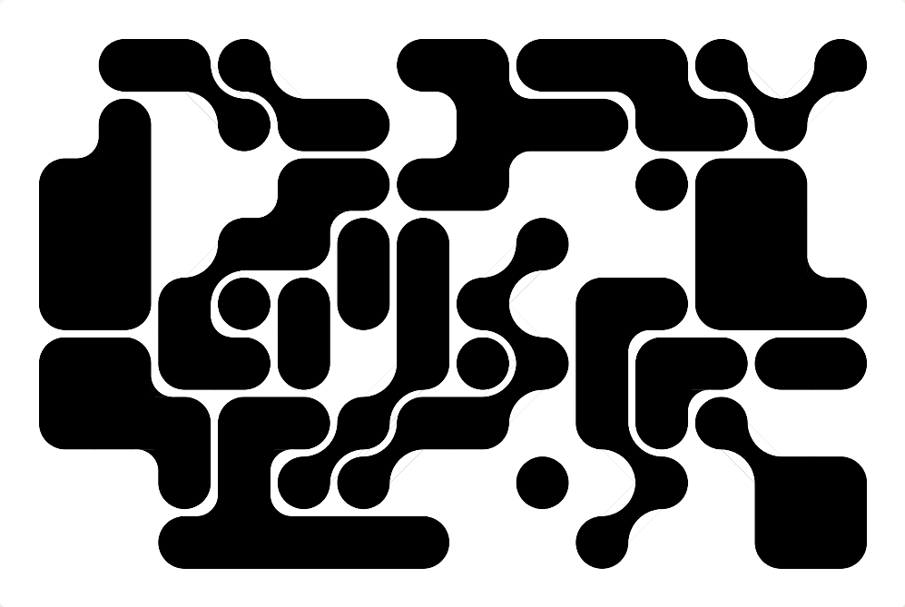

# Generative Brains

A generative artwork tool that grows grid-based blob compositions — circles on a regular grid that fuse into connected, neuron-like clusters. Built by [FinalFinal](https://finalfinal.com) for the UM Institute for Mental Fitness.

**[Open the generator →](https://finalfinalff.github.io/generative-brains/)**

## How it works

Everything is a single self-contained `index.html` (p5.js from CDN — no build, no dependencies). Open it in any browser.

- Distinct blobs are grown one at a time by seeded random walk on a grid until a target density is reached. Each blob carries an identity, and only cells of the same blob fuse — so the composition reads as a packed population of separate objects, tangent but never merging.
- Orthogonal neighbors fuse into capsules and bends with concave fillets; diagonal-only neighbors fuse through skinny metaball necks.
- Same seed + same parameters always reproduces the identical composition. Share a variation with `?seed=N`.

## Controls

| Parameter | Effect |
|-----------|--------|
| Density | Fraction of the grid occupied |
| Blob Size | Max cells per object |
| Snakiness | Tube-like walks vs. clumpy masses |
| Diagonals | How often growth steps diagonally (skinny necks) |
| Neck Width | Waist thickness of diagonal fusions |
| Gap | Channel width between separate objects |
| Roundness / Fillet Depth | Convex corner radius / concave cusp depth |

Download PNG exports at 2400px wide. See `PHILOSOPHY.md` for the design intent and `CLAUDE.md` for the rendering geometry.
